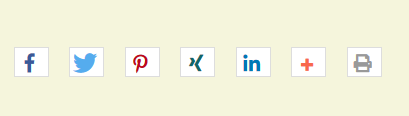
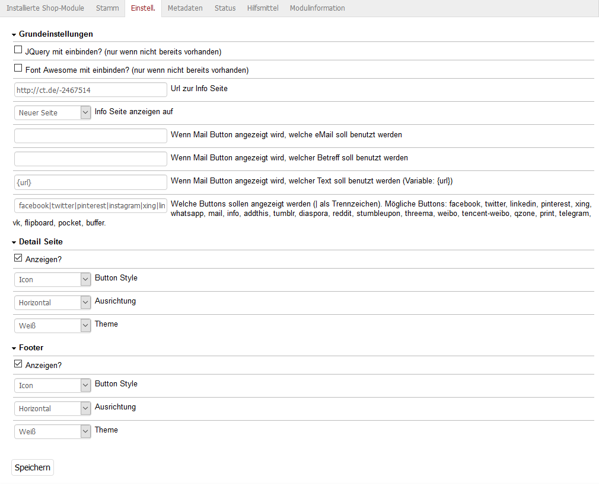

# Oxid Shariff

## Description

Implement the social media buttons in the oxid shop with shariff.

This extension was created for Oxid 6.x.

## Install

1. Copy module into following directory
        
        source/modules/rs/shariff
        
2. Add following to composer.json on the shop root

        "autoload": {
            "psr-4": {
                "rs\\shariff\\": "./source/modules/rs/shariff"
            }
        },
    
3. Refresh autoloader files with composer in the oxid root directory.

        composer dump-autoload
        
4. Enable module in the oxid admin area, Extensions => Modules
5. Changes settings in the module itself

## More informations

Shariff Version 3.2.0

https://github.com/heiseonline/shariff